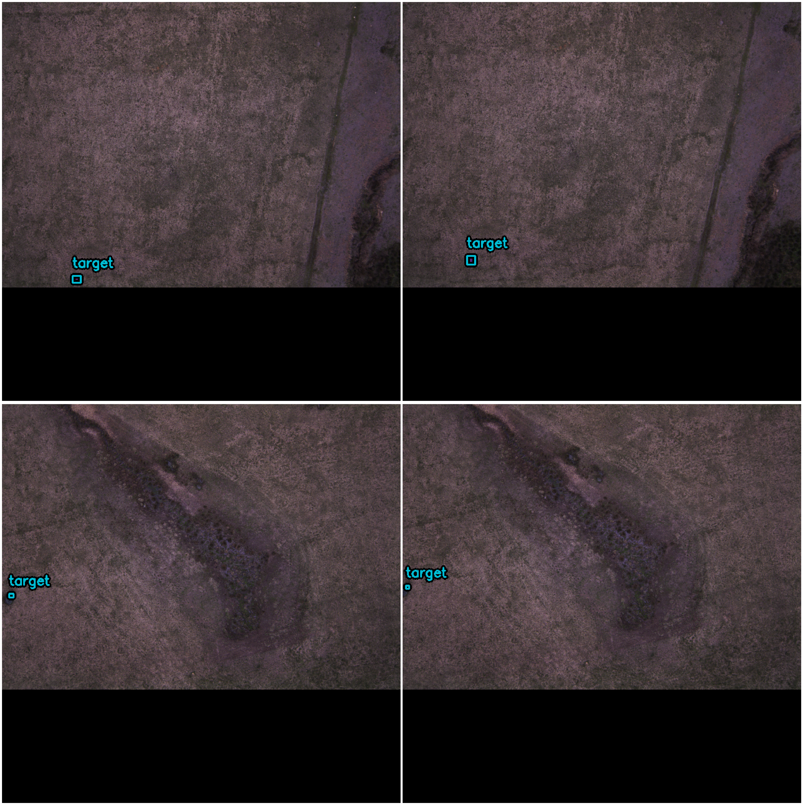

# ADLC

As of right now, this just includes a script for generating a dataset from images and annotations and a notebook for preliminary testing on using a CNN for object detection.

Here is a sample output of `visualize_detections`



Since the images are really high resolution, the lines cover the targets, but the boxes are accurate.

## Data Annotation

For now, I have done data annotation using OpenCVs GUI tool [`opencv_annotation`](https://docs.opencv.org/4.x/dc/d88/tutorial_traincascade.html#Preparation-of-the-training-data), which uses a XYWH bounding-box format. There are annotations in `data/annotation_238.txt`.

To include the corresponding images, you will need to download them from the Kraken computer and place them in `data/flight_238/*.jpg`. They are located in `/RAID/Flights/Flight_238/*.jpg`.

## Setup Development Environment

### Using a Conda/Mamba Environment

Create a conda environment using:

```sh
conda env create --file ncsuadlc_condaenv.yaml -n ncsuadlc
conda activate ncsuadlc

# Some requirements are only up-to-date on PyPi
pip install -r ncsuadlc_pipreqs.txt
```

### Pip Only

```sh
pip install -r requirements.txt
```

## Using cuDNN Acceleration on VLC

NCSU provides VLCs with RTX 2080 GPUs that can be used for training the CNN quickly. CUDA is already installed on these systems but you will need to install cuDNN as well:

```sh
sudo apt-get install libcudnn8=8.8.0.121-1+cuda12.1
sudo apt-get install libcudnn8-dev=8.8.0.121-1+cuda12.1
sudo apt-get install libcudnn8-samples=8.8.0.121-1+cuda12.1
```

To check that cuDNN was set up correctly, run built-in test suite:

```sh
sudo apt-get install libfreeimage3 libfreeimage-dev
cp -r /usr/src/cudnn_samples_v8/ $HOME
cd  $HOME/cudnn_samples_v8/mnistCUDNN
make clean && make
make clean && make
./mnistCUDNN
```

See [cuDNN install guide](https://docs.nvidia.com/deeplearning/cudnn/install-guide/index.html#package-manager-ubuntu-install) for more info.

You will also need to make sure that Tensorflow has needed GPU dependencies using:

```sh
pip install tensorflow[and-cuda]
```
